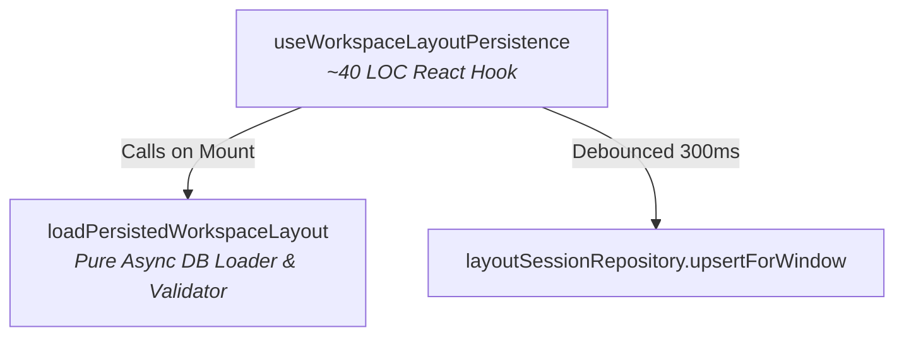
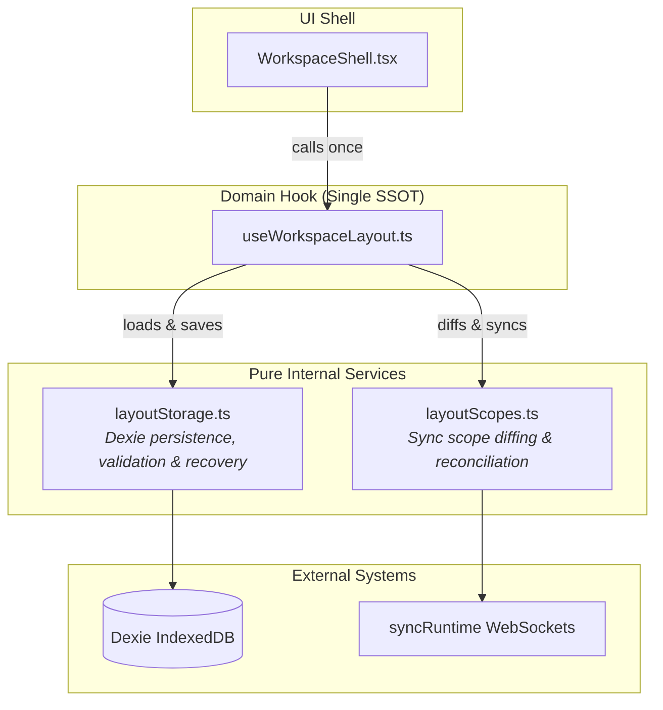

```mermaid
graph TD
    A[useWorkspaceLayoutPersistence<br/><i>~40 LOC React Hook</i>] -->|Calls on Mount| B[loadPersistedWorkspaceLayout<br/><i>Pure Async DB Loader & Validator</i>]
    A -->|Debounced 300ms| C[layoutSessionRepository.upsertForWindow]
```

```mermaid
graph TD
    subgraph "UI Shell"
        Shell[WorkspaceShell.tsx]
    end

    subgraph "Domain Hook (Single SSOT)"
        Hook[useWorkspaceLayout.ts]
    end

    subgraph "Pure Internal Services"
        Storage[layoutStorage.ts<br/><i>Dexie persistence, validation & recovery</i>]
        Scopes[layoutScopes.ts<br/><i>Sync scope diffing & reconciliation</i>]
    end

    subgraph "External Systems"
        Dexie[(Dexie IndexedDB)]
        WS[syncRuntime WebSockets]
    end

    Shell -->|calls once| Hook
    Hook -->|loads & saves| Storage
    Hook -->|diffs & syncs| Scopes
    Storage --> Dexie
    Scopes --> WS
```
