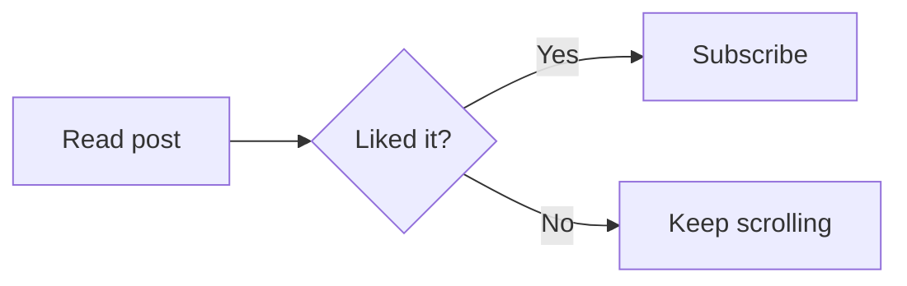
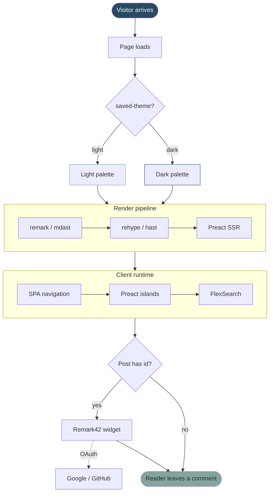

```mermaid
flowchart LR
    A[Read post] --> B{Liked it?}
    B -- Yes --> C[Subscribe]
    B -- No --> D[Keep scrolling]
```
test
## test

```mermaid
flowchart TB
    Start([Visitor arrives]) --> Load[Page loads]
    Load --> Theme{saved-theme?}

    Theme -- light --> LightPalette[Light palette]
    Theme -- dark --> DarkPalette[Dark palette]
    LightPalette --> Render
    DarkPalette --> Render

    subgraph Render [Render pipeline]
        direction LR
        Parse[remark / mdast] --> Transform[rehype / hast] --> JSX[Preact SSR]
    end

    Render --> Interact

    subgraph Interact [Client runtime]
        direction LR
        SPA[SPA navigation] --> Islands[Preact islands]
        Islands --> Search[FlexSearch]
    end

    Interact --> Comments{Post has id?}
    Comments -- yes --> Remark42[Remark42 widget]
    Comments -- no --> Done

    Remark42 -.OAuth.-> Provider[Google / GitHub]
    Remark42 --> Done([Reader leaves a comment])

    style Start fill:#284b63,color:#faf8f8
    style Done fill:#84a59d,color:#2b2b2b
    style LightPalette stroke:#84a59d
    style DarkPalette stroke:#284b63
```